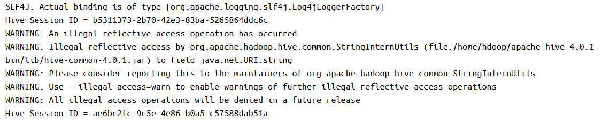
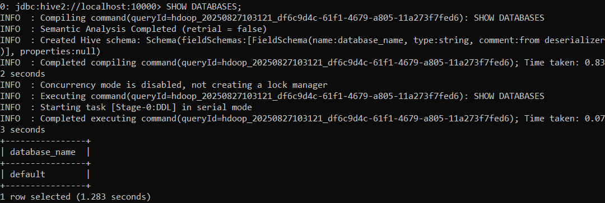

# spark-hive-hadoop-jupyter
Docker Image for Spark-3.5.6, Hive-4.0.1, Hadoop-3.4.1 with Jupyter Notebook

**Пожалуйста, не используйте в продакшене. Образ подходит только для обучения** 
 
**Ещё одно предупреждение: файлы в контейнере не сохраняются, нет volumes и при каждом запуске контейнера выполняется команда hdfs namenode -format** 
 

## Загрузка образа и создание контейнера
Чтобы поработать с образом, сначала скопируйте его в локальный каталог:
<pre>
    <code>
git clone https://github.com/RuslanBelko/spark-hive-hadoop-jupyter.git
    </code>
</pre>

1. Открываем терминал и там переходим в скопированный каталог: `cd /path/to/copied/catalog`
2. `docker build -t spark-hive-hadoop-jupyter .`
3. Дожидаемся, пока образ соберётся
4. Запускаем наш контейнер
<pre>
    <code>
docker run -d -p 9870:9870 -p 9864:9864 -p 8088:8088 -p 10000:10000 -p 10002:10002 -p 8080:8080 -p 8888:8888 --name spark-hive-hadoop-jupyter-container spark-hive-hadoop-jupyter:latest
    </code>
</pre>
5. Дожидаемся окончания запуска. P.S. в контейнере запускаются Hadoop, Spark, Hive Server, именно в таком порядке. Если всё прошло успешно, в docker desktop в логах последними строками будет что-то вроде того, что отражено на скриншоте ниже 

6. На данном этапе можно проверить, что Hadoop, Hive и Spark запущены:
    - localhost:9870 - Hadoop Namenode
    - localhost:9864 - Hadoop Datanode
    - localhost:10002 - HiveServer2
    - localhost:8080 - Spark Master. Здесь дополнительным подтверждением должно также стать то, что в категории Workers будет отражен один запущенный Worker

Итак, у нас есть работающий кластер.

## Запуск Hive пользователя

1. Открываем терминал
2. Логинимся в контейнере:
<pre>
    <code>
docker exec -it spark-hive-hadoop-jupyter-container bash
    </code>
</pre>
3. Переходим в домашний каталог Hive:
<pre>
    <code>
cd $HIVE_HOME
    </code>
</pre>
4. Запускаем следующую команду:
<pre>
    <code>
bin/beeline -n hive -u jdbc:hive2://localhost:10000
    </code>
</pre>
5. Всё, нам доступен интерфейс Hive: 

## Запуск Jupyter Notebook

Важный момент: spark установлен в контейнере без использования Pyspark. Чтобы получить к нему доступ из ноутбука, нужно использовать следующие команды:
<pre>
    <code>
import findspark
findspark.init()
import pyspark # не нужно отдельно устанавливать с помощью pip install
    </code>
</pre>

1. Открываем терминал
2. Логинимся в контейнере:
<pre>
    <code>
docker exec -it spark-hive-hadoop-jupyter-container bash
    </code>
</pre>
3. Проверяем, что оказались в домашнем каталоге пользователя hdoop. Если нет, то `cd ~`
4. Запускаем виртуальную среду (создана в рамках образа):
<pre>
    <code>
source jupyter_env/bin/activate
    </code>
</pre>
5. Запускаем jupyter notebook (часть с IP нужна, чтобы был доступ с хоста - т.е. с локального компьютера):
<pre>
    <code>
jupyter notebook --ip=0.0.0.0 --port=8888
    </code>
</pre>

Используем Jupyter Notebook

## Pyspark в Jupyter Notebook

1. В образе есть папка /home/hdoop/Jupyter_notebooks. В ней есть файл pyspark_notebook.ipynb. Это файл с небольшим примером, как работает Spark с Hive.